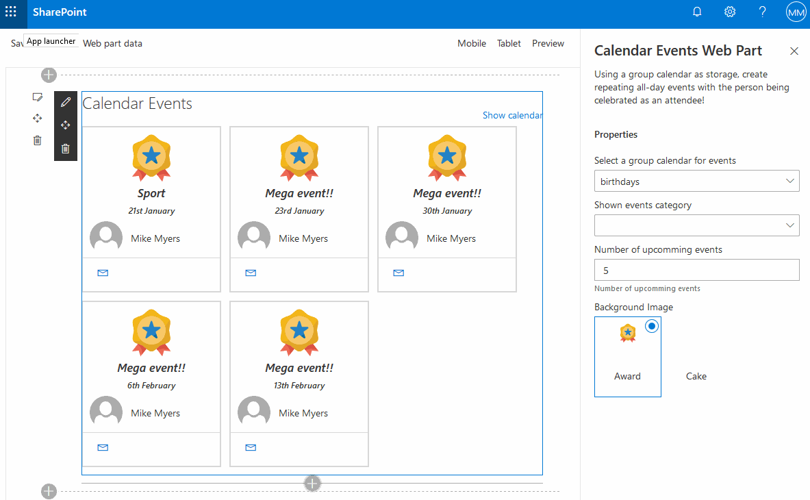

# React Calendar Events Web Part

## Summary

Based on react-birthdays, this version uses a group calendar to store events to fully support recurrence.
Can be used to show arbitrary recurring events from group calendars (not only birthdays!).

It is also streamlined by :
* Using react functional components
* Using react hooks
* Removing Connectors to SharePoint lists

## Used SharePoint Framework Version

## Applies to

* [SharePoint Framework](https:/dev.office.com/sharepoint)
* [Office 365 tenant](https://dev.office.com/sharepoint/docs/spfx/set-up-your-development-environment)

## Solution

Solution|Author(s)
--------|---------
react calendar events Web Part|Martin Cyr and Robert Bouchard

## Version history

Version|Date|Comments
-------|----|--------
1.0.0|December 15 2019|Cleanup
1.1.0|January 20 2020|Initial release

## Disclaimer
**THIS CODE IS PROVIDED *AS IS* WITHOUT WARRANTY OF ANY KIND, EITHER EXPRESS OR IMPLIED, INCLUDING ANY IMPLIED WARRANTIES OF FITNESS FOR A PARTICULAR PURPOSE, MERCHANTABILITY, OR NON-INFRINGEMENT.**

### Attributions

Icon|Attribution
----|-----------
award.svg|Icon made by [mynamepong](https://www.flaticon.com/authors/mynamepong) from www.flaticon.com
cake.svg|Icon made by [Smashicons](https://www.flaticon.com/authors/Smashicons) from www.flaticon.com

## Minimal Path to Awesome - please follow all the steps.

- Clone this repository
- Create a [group calendar](https://outlook.office.com/calendar/view/month)
- Add an event
    - Add a title
    - Invite someone
    - Optionally select a category
- in the command line run:
  - `npm install`
  - `gulp build`
  - `gulp bundle --ship`
  - `gulp package-solution --ship`
  - Add and Deploy Package to AppCatalog
  - Go to API Management - from SharePoint Admin Center new experience,  and Approve the Permission Require to Use Graph API SCOPES
- Add the webpart and configure it to point to the calendar created earlier
 

## Features
This project contains sample calendar events web parts built on the SharePoint Framework using React
and Office 365 group calendars.
This sample illustrates the following concepts on top of the SharePoint Framework:
- using React functionnal components for building Calendar Events web part
- using Reac Hooks state and effects
- using MSGraph API to get data from group calendars
- using profile picture endpoint
